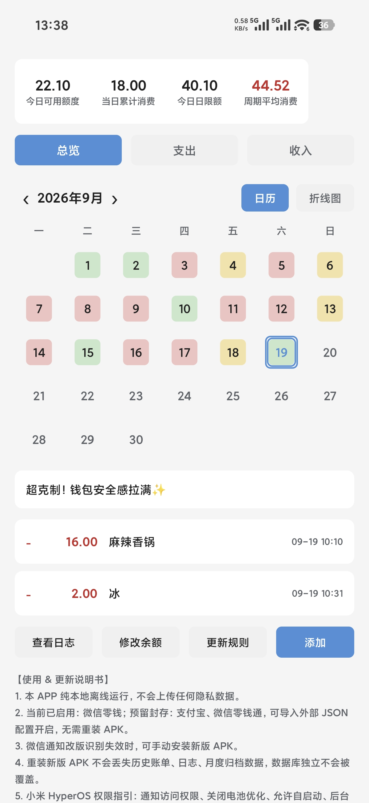
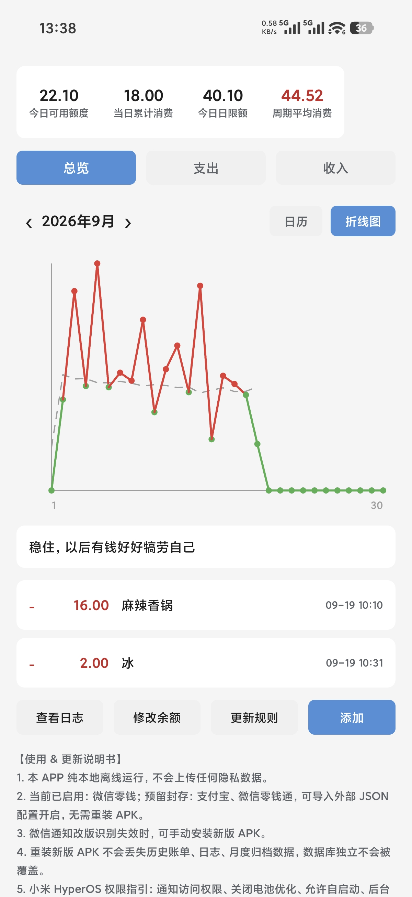
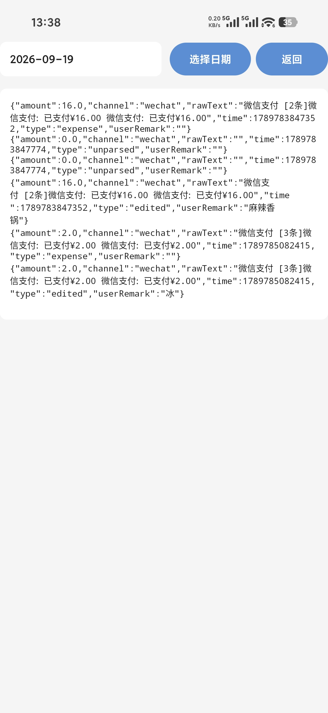

# 邻家账本 · NeighborLedger

**一个纯本地、完全离线的 Android 记账 App。不联网、不上传、无广告、无统计 SDK。**

它只做一件事：**让你看见自己无意识花掉的钱。**

<p>
  
  
  
  
</p>

---

## ⚠️ 先说清楚：这是几个**刻意的设计取舍**

这不是没做完，是想清楚了才这样做的。请先看完这一节，再决定要不要用。

### 1. 只记花销，**不记入账**（故意设计）

**入账不会记录** —— 这是我刻意的设计。

因为**花钱往往是无意识的**：一杯奶茶、一次打车、顺手的一单外卖，事后完全想不起来。记账真正有价值的地方，是把「无意识的花销」变回「看得见的数字」；而收入通常就那么几笔、金额你本来心里有数，把它记进来反而稀释了重点。

所以：**这个 App 只关心你花了多少，不关心你赚了多少。**

> 少数入账通知（例如微信红包）本身不带金额，程序最多留一条占位，不影响任何花销统计。

### 2. 目前只针对**微信零钱**做了优化

当前唯一做通知解析适配的渠道是 **微信零钱（微信支付）**。其余渠道的通知格式**尚未适配**。

### 3. 另外两个接口**仍然封存**

工程内预留了 **支付宝**、**微信零钱通** 两个渠道解析器，但**默认关闭（封存）**。
它们可以通过外置 JSON 配置开启，无需重新编译 APK；**当前版本保持关闭**。

### 4. **花销的备注要手动编辑**

支出记录自动抓取的只有 **金额与时间**；这笔钱花在哪（备注内容）需要你**手动编辑**。
不做自动分类、不做商户识别——保持本地、轻量、可控。

---

## 📸 截图

| 日历 · 每日额度 | 折线图 · 消费趋势 | 日志 · 原始通知 |
| :---: | :---: | :---: |
|  |  |  |

---

## ⬇️ 下载安装

- **[NeighborLedger-v1.4.1.apk](NeighborLedger-v1.4.1.apk)** —— debug 构建，13.8 MB，直接传到手机安装即可。
- 装好后请在系统设置里给「邻家账本」开启**通知使用权**（逐步说明见 `安装到手机-打包安装步骤.txt`）。

---

## ✨ 功能

- **通知自动记账**：读取微信支付通知，自动抓取金额与时间入账（本地解析，不联网）。
- **月历视图**：每天按「当日消费 ÷ 当日限额」着色，超支标红，一眼看出哪天花超了。
- **折线图 / 月度归档**：历史消费趋势离线归档，随取随看。
- **额度三件套**：今日可用额度、当日累计消费、周期平均消费。
- **超额提醒**：当日已超支后再花一笔时，弹出一条本地通知提醒。
- **条目操作**：长按 → 编辑 / 删除 / 多选批量删除；双击 → 改备注。
- **手势**：条目左右滑切上一天/下一天，日历左右滑切月。
- **手动补录**：底部「添加」可直接记一笔。
- **查看日志**：留存每条通知的**原始文本**，解析失败时一目了然，方便自行排查。
- **修改余额**：手动校准当前可用总余额，据此重算额度。
- **外置 JSON 配置**：渠道开关 / 正则 / 文案均可通过导入 JSON 更新，**改规则不用重装**。
- **二次元人设文案**：超额提醒等文案由「邻家少女」口吻给出（纯本地文案，无联网生成）。

---

## 🔒 隐私

- **全程离线**：App **没有申请 `INTERNET` 权限**，从源码层面杜绝上传可能。
- 仅申请四类权限：通知使用权（读收支通知）、前台服务（保活）、开机自启（恢复监听）、通知展示。
- 数据全部落在 App 私有目录（数据库 / 日志 / 月度归档 / 配置相互隔离），**覆盖安装与升级不会丢数据**。
- **不采集、不上传、不统计、无广告 SDK。**

---

## 📱 运行环境

- **MinSDK 33（Android 13）**，targetSdk / compileSdk 35。
- 开发验证机型：**小米 HyperOS 3 / 骁龙 8 Gen5**。
- Kotlin 1.9.24 · AGP 8.7.3 · Gradle 8.9 · JDK 17 · Room 2.6.1 · WorkManager 2.9.1 · Material3。
- 月历与折线图为**自绘 View**，不引第三方图表库，保持轻量低内存。

---

## 🔨 编译 & 安装

**用 Android Studio（Hedgehog 及以上，自带 JDK 17）：**

1. 打开本目录（`NeighborLedger`）。
2. 首次 Sync 会按 `gradle/wrapper/gradle-wrapper.properties` 自动下载 Gradle 8.9 与依赖（**仅构建时需要联网**；App 运行时全程离线）。
3. `Build → Build APK(s)`，产出 `app/build/outputs/apk/debug/app-debug.apk`。
4. 传到手机安装，然后在系统设置里给「邻家账本」开启**通知使用权**，并建议：关闭电池优化、允许自启动、设为后台无限制。

> 工程未内置二进制 `gradle-wrapper.jar`，Android Studio 首次 Sync 会自动补全；命令行构建请先执行一次 `gradle wrapper`。`local.properties` 中的 `sdk.dir` 为你本机 SDK 路径，**不要提交到仓库**（已在 `.gitignore` 中排除）。

---

## 🗂 工程结构

```
NeighborLedger/
├─ settings.gradle.kts / build.gradle.kts / gradle.properties
├─ gradle/wrapper/gradle-wrapper.properties
└─ app/
   ├─ build.gradle.kts
   └─ src/main/
      ├─ AndroidManifest.xml
      ├─ assets/default_config.json            # 外置 JSON 配置（渠道开关 / 正则 / 文案 / 版本）
      ├─ res/                                   # 布局、主题、配色、图标
      └─ java/com/neighbor/ledger/
         ├─ LedgerApp.kt                        # 依赖装配
         ├─ data/      Db.kt WalletPrefs.kt BillRepository.kt
         ├─ budget/    BudgetEngine.kt          # 唯一预算数学来源
         ├─ config/    Config.kt                # 外置 JSON 模型 + 导入 / 校验
         ├─ parser/    Parsers.kt               # 统一抽象解析层 + 4 渠道
         ├─ persona/   Persona.kt               # 二次元少女人设文案路由
         ├─ log/       DailyLogWriter.kt        # logs/yyyy-MM-dd.log
         ├─ chart/     ChartArchive.kt LineChartView.kt MonthCalendarView.kt
         ├─ service/   LedgerNotificationService.kt OverBudgetNotifier.kt Workers.kt
         └─ ui/        MainViewModel.kt MainActivity.kt BillAdapter.kt LogViewerActivity.kt
```

---

## 🔧 关键实现口径

### 预算数学
- 每月 1 号 12:00 自动扣 **300** 定期存款，写一条 `isDeposit = true` 特殊记录（**不计入消费统计**），并固定当月可支配总预算。
- `当日限额 = 当前可用总余额 ÷ 当月剩余天数（含当日）`，**保留 2 位小数、向下取整**。
  - 核对：9 月 11 号 → 30−11+1 = 20 天，800 / 20 = 40 ✓；9 月 12 号 → 19 天，720 / 19 = 37.8947… → **37.89**。
- `可用额度 + 当日累计消费 = 当日限额`；收支变动立刻重算后续日限额基准。

### 通知解析抽象层
- `PaymentNotificationParser` 抽象基类 + 4 个子类：`WeChatChangeParser`（默认启用）、`AliPayParser`、`WeChatMoneyFundParser`、`OtherChannelParser`（三者**封存关闭**，由 JSON `enabled` 开关激活；关闭即短路、零性能开销）。
- 渠道开关 / 正则 / 文案全部在 `assets/default_config.json`；点击「更新解析规则」导入新 JSON **只改参数，不改源码 / UI 骨架 / 表结构**，开启新渠道无需重编译 APK。

### 防重复入账
- 同一笔交易的通知可能被并发重复派发。程序对**支出**按「同数额 30 秒内只记第一笔」去重，对**入账**按「同数额 + 同原文」去重，并用原子化的 check-and-set 规避并发竞态。

---

## ⚠️ 已知限制

- 目前**仅适配微信零钱**；支付宝、微信零钱通渠道**封存未开启**。
- **入账不记录**（刻意设计，见上）。
- 花销备注**需手动编辑**，不做自动分类 / 商户识别。
- 依赖系统通知文本，微信改版可能导致识别暂时失效；可通过导入新 JSON 规则修复，或等待新版 APK。

---

## 📄 License

本项目基于 **MIT License** 开源，详见 [LICENSE](LICENSE)。

---

## 免责声明

本项目仅供个人学习与自用记账。通知解析依赖系统通知文本，不保证对所有版本 / 机型 / 渠道均准确；因使用本项目产生的任何数据偏差或损失，作者不承担责任。请勿用于任何违反相关服务条款的用途。